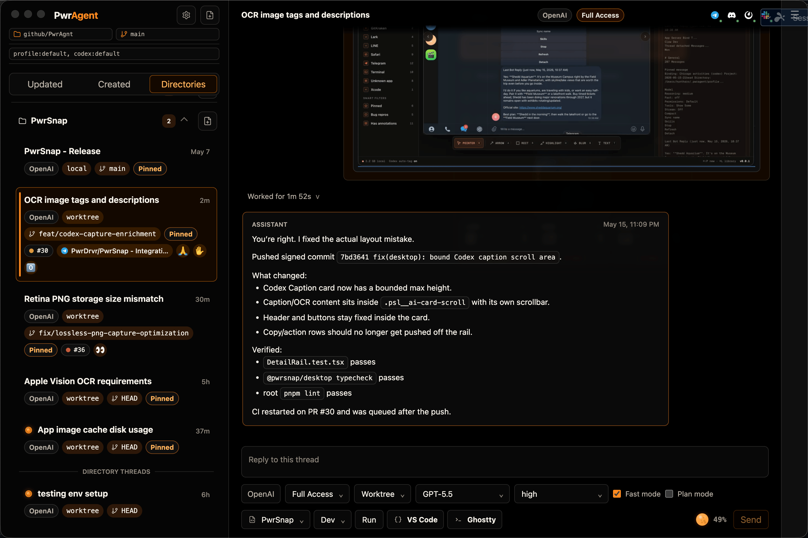
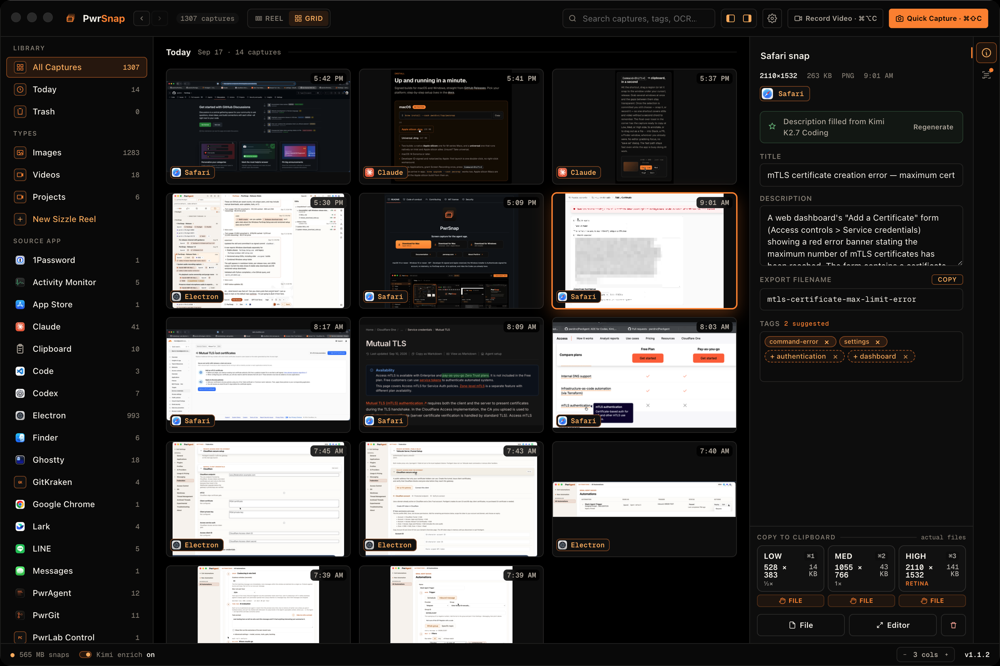

<div align="center">

<h1>PwrDrvr apps for your Mac</h1>

<strong>Run coding agents. Capture what matters. Keep moving.</strong>

<p>Free, open-source desktop apps from <a href="https://pwrdrvr.com">PwrDrvr</a>.<br>
MIT licensed. Signed and notarized. One command to install.</p>

</div>

Have [Homebrew](https://brew.sh)? Pick an app below and paste its install command into your terminal.

---

## [PwrAgent](https://pwragent.ai)

**Run coding agents by the dozen.**

Keep agents working across your repos, each in its own git worktree.
Watch the diffs, track the PRs, and steer your threads from your desktop or
your favorite messenger. Use the coding-agent CLI and plan you already have.

[](https://pwragent.ai)

**Install PwrAgent**

```bash
brew install --cask pwrdrvr/tap/pwragent
```

macOS 12 Monterey or newer · Apple Silicon + Intel

[Explore PwrAgent](https://pwragent.ai) · [Documentation](https://docs.pwragent.ai) · [Source code](https://github.com/pwrdrvr/PwrAgent)

---

## [PwrSnap](https://pwrsnap.com)

**Screen capture for the agent age.**

Capture screenshots and screen recordings, annotate them, and find them again
in a library organized by source app. Copy at the resolution you need, or
bring in optional AI through the agent install you already use.

[](https://pwrsnap.com)

**Install PwrSnap**

```bash
brew install --cask pwrdrvr/tap/pwrsnap
```

macOS 14 Sonoma or newer · Apple Silicon + Intel

[Explore PwrSnap](https://pwrsnap.com) · [Documentation](https://docs.pwrsnap.com) · [Source code](https://github.com/pwrdrvr/PwrSnap)

---

<details>
<summary>Updates, uninstalling, and Homebrew trust</summary>

Both apps update themselves. To update through Homebrew, run the command for your app:

```bash
brew upgrade --cask --greedy pwrdrvr/tap/pwragent
```

```bash
brew upgrade --cask --greedy pwrdrvr/tap/pwrsnap
```

To uninstall:

```bash
brew uninstall --cask pwrdrvr/tap/pwragent
```

```bash
brew uninstall --cask pwrdrvr/tap/pwrsnap
```

PwrAgent preserves `~/.pwragent`, including profiles and thread state.
For PwrSnap, adding `--zap` also removes settings, caches, and logs; your
captures in `~/Documents/PwrSnap` are preserved.

If Homebrew reports an untrusted cask, trust the app you are installing:

```bash
brew trust --cask pwrdrvr/tap/pwragent
```

```bash
brew trust --cask pwrdrvr/tap/pwrsnap
```

</details>

[Maintaining this tap](docs/maintenance.md) · [About PwrDrvr](https://pwrdrvr.com/about)
